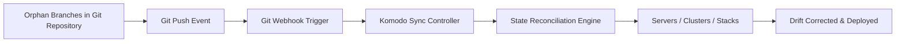
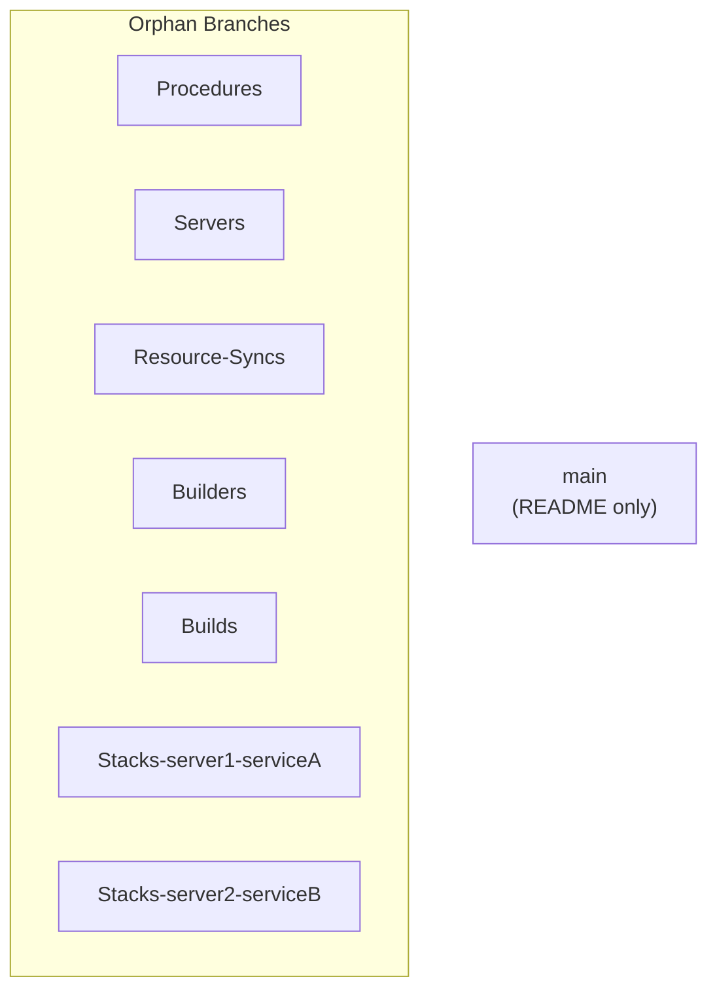
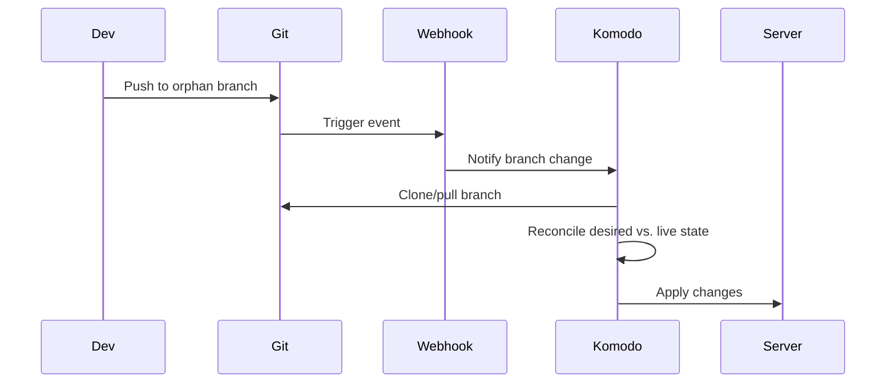
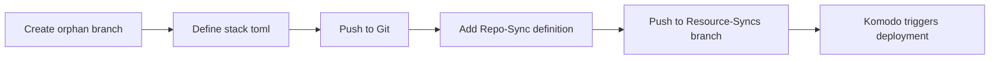

# DriftCatcher: A GitOps Control Plane for Komodo

**DriftCatcher** serves as the GitOps control center for managing infrastructure and application states using [Komodo](https://komo.do/docs/intro). It enforces a declarative, immutable source of truth across all environments by leveraging Git’s orphan branch model to logically separate and independently manage distinct infrastructure resource types.

This repository deviates from the traditional trunk-based Git workflow. Instead, it employs **orphan branches** to segregate definitions by domain (e.g., servers, builds, syncs, procedures, stacks). This clean separation ensures robust drift prevention, enhanced auditability, and fine-grained automation triggers.

---

## 📑 Table of Contents

- [Requirements](#-requirements)
- [Purpose](#-purpose)
- [Key Benefits](#-key-benefits)
- [Architecture Overview](#-architecture-overview)
- [Repository Layout](#-repository-layout)
- [Why Orphan Branches?](#-why-orphan-branches)
- [Operational Flow](#-operational-flow)
- [Creating a New Stack](#️-creating-a-new-stack)
- [Best Practices](#-best-practices)
- [Troubleshooting](#-troubleshooting)

---

## ⚙️ Requirements

- **Git Server** with webhook support (GitHub, GitLab, Gitea, etc.)
- **Komodo** installed and configured to connect to your Git repository
- Network connectivity from Komodo to all managed servers/clusters

---

## 📌 Purpose

DriftCatcher is designed to **eliminate infrastructure and deployment drift** by ensuring that all configurations—from stack definitions to resource synchronization policies—are **declaratively defined in Git** and automatically enforced using **Komodo**.

Whenever a developer, operator, or automation system pushes a change to one of the orphan branches, a **Git webhook** triggers a Komodo synchronization. Komodo then ensures the live state matches the declared Git state, eliminating manual interventions and discrepancies.

---

## 🚀 Key Benefits

| Benefit                         | Description                                                                                     |
| ------------------------------- | ----------------------------------------------------------------------------------------------- |
| **Drift Prevention**            | Ensures that infrastructure and app states always reflect Git’s declarative source of truth.    |
| **Fine-Grained Separation**     | Orphan branches isolate resources by domain, preventing accidental changes and history clutter. |
| **Auditability & Traceability** | Every change is tracked per branch, improving change tracking and rollback granularity.         |
| **Automated Enforcement**       | Changes trigger automated syncs, reducing manual error and deployment lag.                      |
| **Flexible Sync Policies**      | Resource synchronization configurations can target specific branches or servers independently.  |

---

## 🧭 Architecture Overview



---

## 📂 Repository Layout

This repository follows a **structured orphan-branch layout**, diverging from the traditional folder-based structure. Each branch is isolated and self-contained, tracking only the resources pertinent to its domain.

### Branch Types



---

## 🧩 Why Orphan Branches?

Orphan branches provide **zero history inheritance**, preventing cross-contamination of Git histories. This approach offers:

- Logical and audit-safe separation of each domain
- Clean, flat, single-purpose branches
- Lightweight CI/CD triggers and sync scopes
- Elimination of accidental coupling between unrelated environments or resources

---

## 🔄 Operational Flow



---

## 🛠️ Creating a New Stack



### Step-by-Step

1. **Create a new orphan branch:**

   ```bash
   git checkout --orphan Stacks-myserver-myservice
   ```

2. **Add stack definition:**

   ```toml
   [[stack]]
   name = "generic-stack"
   description = "A generic stack deployment configuration."
   tags = ["tag1", "tag2"]

   [stack.config]
   server = "target-server"
   git_provider = "git.example.com"
   git_account = "git-user"
   repo = "org-name/repo-name"
   branch = "main"
   commit = "abcdef123456"
   reclone = true
   ......
   ```

3. **Commit and push:**

   ```bash
   git add .
   git commit -m "Initial stack for myserver/myservice"
   git push origin Stacks-myserver-myservice
   ```

4. **Define sync policy in `Resource-Syncs`:**

   ```toml
    [[resource_sync]]
    name = "generic-sync"
    description = "A generic resource sync configuration."
    tags = ["tag1", "tag2"]

    [resource_sync.config]
    git_provider = "git.example.com"
    git_account = "git-user"
    repo = "org-name/repo-name"
    branch = "main"
    commit = "abcdef123456"
    ......
   ```

5. **Push sync config:**

   ```bash
   git checkout Resource-Syncs
   git add .
   git commit -m "Add sync for myserver/myservice"
   git push origin Resource-Syncs
   ```

---

## 📊 Best Practices

- ✅ Use `--orphan` when creating new branches
- ✅ Use meaningful branch names: `Stacks-<server>-<service>`
- ✅ Commit only declarative resources
- ❌ Never commit secrets or credentials
- ✅ Document major infrastructure changes
- ✅ Use signed commits if possible

---

## 🧪 Troubleshooting

| Problem                        | Solution                                                           |
| ------------------------------ | ------------------------------------------------------------------ |
| Webhook not triggering         | Verify webhook and orphan branch inclusion                         |
| Stack not deployed             | Ensure matching RepoSync in `Resource-Syncs`                       |
| Drift not corrected            | Confirm Git push occurred and Komodo has necessary permissions     |
| Invalid resource errors        | Run `komodo validate` locally before pushing                       |
| Secrets accidentally committed | Rotate them immediately and use `.gitignore` with secure workflows |

---
**THIS REPOSITORY IS ENCRYPTED. IF YOU'RE HERE, YOU'RE EITHER VERY BRAVE OR VERY LOST. EITHER WAY, GOOD LUCK!**
